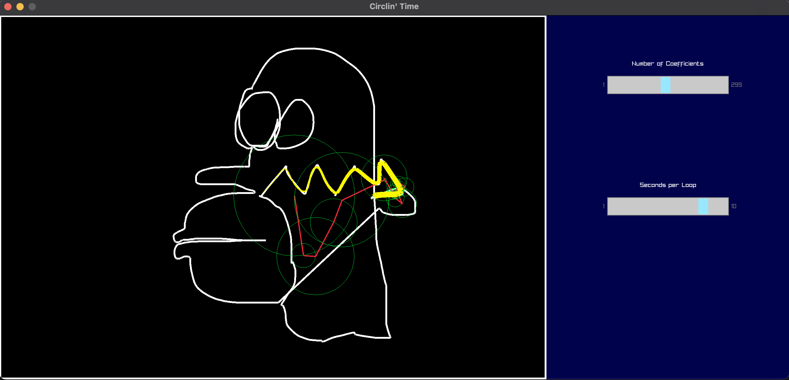

# Drawing using Circles (Fourier Series) 

Small Project in C to explore the fourier series.

Inspired by 3b1b https://www.youtube.com/watch?v=r6sGWTCMz2k.

Used Raylib and Raygui (in extern) for the GUI.
https://www.raylib.com

nanoSVG to parse SVGs.
https://github.com/memononen/nanosvg

