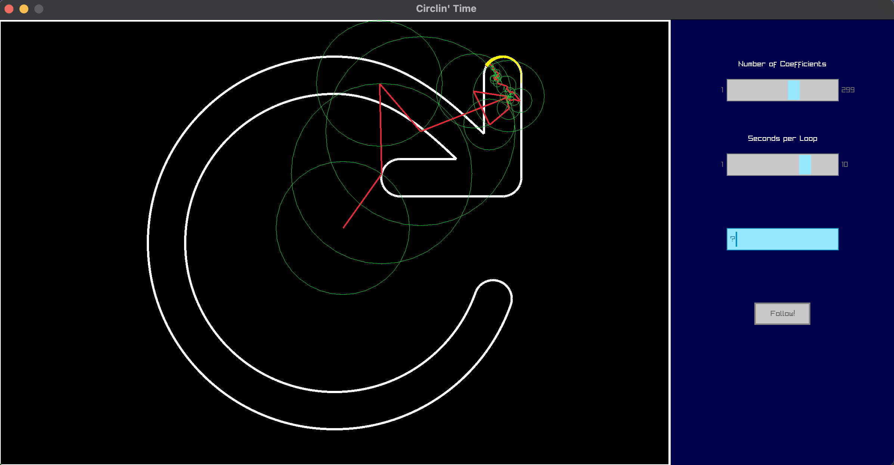
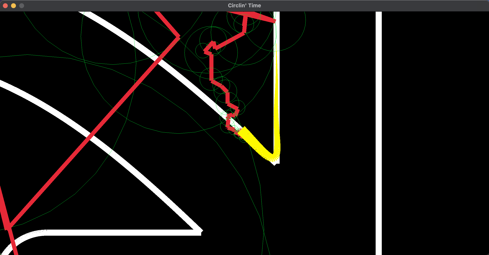

# Drawing using Circles (Fourier Series) 

Small Project in C to explore the fourier series.

Inspired by 3b1b https://www.youtube.com/watch?v=r6sGWTCMz2k.

Used Raylib and Raygui (in extern) for the GUI.
https://www.raylib.com

nanoSVG to parse SVGs.
https://github.com/memononen/nanosvg

SVGs in resources found on
https://www.svgrepo.com

TODO: Maybe optimize path when loading svgs instead of using default
starting and end points (i.e. minimize paths across image when closing the shape).
